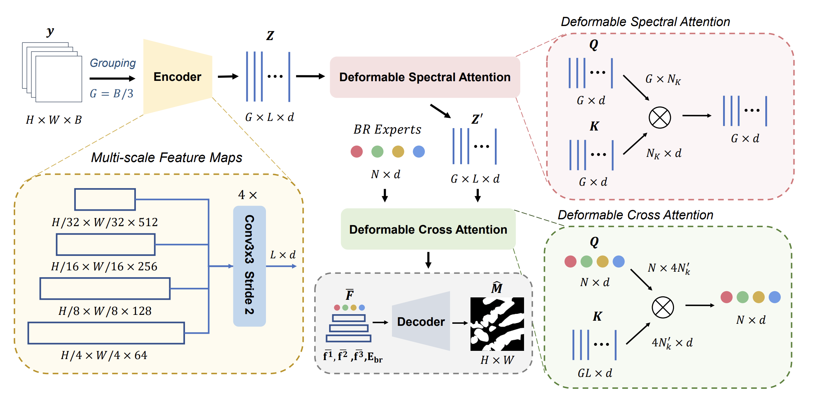

Exploring Hyperspectral Histopathology Image Segmentation from A Deformable Perspective
===========
<details>
<summary>
  <b>Exploring Hyperspectral Histopathology Image Segmentation from A Deformable Perspective</b>, ACM MM 2023 Oral.
  <a href="https://dl.acm.org/doi/10.1145/3581783.3611796" target="blank">[HTML]</a>
  <br><em>Xingran Xie, Ting Jin, Boxiang Yun, Qingli Li, Yan Wang</em></br>
</summary>

```bash
@inproceedings{Xie2023DFS3R,
  author = {Xingran Xie, Ting Jin, Boxiang Yun, Qingli Li, Yan Wang},
  title = {Exploring Hyperspectral Histopathology Image Segmentation from A Deformable Perspective},
  booktitle = {Proceedings of the 31st {ACM} International Conference on Multimedia, {MM} 2023, Ottawa, ON, Canada, 29 October 2023- 3 November 2023},
  pages = {242--251},
  year = {2023},
}
```
</details>

**Summary:** Hyperspectral images (HSIs) offer great potential for computational pathology. However, limited by the spectral redundancy and the lack of spectral prior in popular 2D networks, previous HSI based techniques do not perform well. To address these problems, we propose to segment HSIs from a deformable perspective, which processes different spectral bands independently and fuses spatiospectral features of interest via deformable attention mechanisms. In addition, we propose Deformable Self-Supervised Spectral Regression (DF-S3R), which introduces two self-supervised pre-text tasks based on the low rank prior of HSIs enabling the network learning with spectrum-related features. During pre-training, DF-S3R learns both spectral structures and spatial morphology, and the jointly pre-trained architectures help alleviate the transfer risk to downstream fine-tuning.



## Installation Guide

### Environment:
```bash
$ conda create -n dfs3r python=3.8
$ conda activate dfs3r
$ conda install pytorch==1.11.0 torchvision==0.12.0 torchaudio==0.11.0 cudatoolkit=11.3 -c pytorch

$ cd ./model/backbones/ops 
$ python setup.py build install

$ pip install -r requirements.txt
```

## Training on HSI Dataset

### Project Structure

After dataset partition, the paths of images (.npy format) and masks (.png format) are stored in .txt file.

```
# train.txt
/path/image/042145-20x-roi7.npy /path/mask/042145-20x-roi7.png
/path/image/042145-20x-roi1.npy /path/mask/042145-20x-roi1.png
/path/image/042145-20x-roi10.npy /path/mask/042145-20x-roi10.png
```

The folder structure is as follows:

```bash
DFS3R-master/
    └──checkpoint/
        ├── segmentation/
        └── pretrain/
    └──dataset/
        ├── segmentation
        │   ├── test.txt
        │   ├── train.txt
        │   └── val.txt
        └── ssl_dataset.py
    ...
```

### Self-supervised Pretraining

Hyper-parameters need to be set in `ssl_config.py`.

```shell
CUDA_VISIBLE_DEVICES=<DEVICE ID> python main_dp_pretrain.py 
```

### Finetuning

Hyper-parameters need to be set in `seg_config.py`. If you want to load self-supervised pretrained model, you should set `MODEL.PRETRAIN = True` and `MODEL.PRETRAIN_CKPT` in `seg_config.py`.

```shell
CUDA_VISIBLE_DEVICES=<DEVICE ID> python main_dp_segmentation.py 
```

## License & Usage 
If you find our work useful in your research, please consider citing our paper at:
```bash
@inproceedings{Xie2023DFS3R,
  author = {Xingran Xie, Ting Jin, Boxiang Yun, Qingli Li, Yan Wang},
  title = {Exploring Hyperspectral Histopathology Image Segmentation from A Deformable Perspective},
  booktitle = {Proceedings of the 31st {ACM} International Conference on Multimedia, {MM} 2023, Ottawa, ON, Canada, 29 October 2023- 3 November 2023},
  pages = {242--251},
  year = {2023},
}
```

© [Mahmood Lab](http://www.mahmoodlab.org) - This code is made available under the GPLv3 License and is available for non-commercial academic purposes. 
